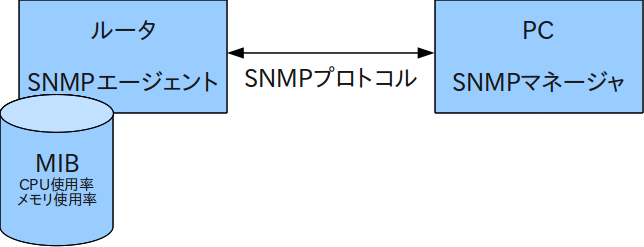

===========================================
SNMP - Simple Network Management Protocol
===========================================

:Version:
    1.0 of 2011/03/10

:Author:
    SUZUKI Masashi / masasuzu

:Mail:
    m15.suzuki.masashi@gmail.com

Agenda
=======

#. SNMPの概要
#. SNMPのバージョン
#. オブジェクトID
#. プログラムからSNMPにアクセスする

SNMPの概要
=====================

ネットワーク管理と各種モニタリングのためのプロトコル。

対象はルータやスイッチに限らず、Unixシステム、Windows、プリンタ、電源、WEBサーバ、DBサーバを監視できます。

SNMPの機能
------------

SNMP主な機能には主に3つの機能があります。\
ここでは、管理対象機器を監視するノードを *管理機* 管理対象機器が持つ情報を *管理情報* とします。

#. 管理対象機器が管理機に情報の **通知** する
#. 管理機が管理対象機器に管理情報を **要求** する
#. 管理機が管理対象機器に **設定** する

っね、シンプルでしょ。

SNMP管理フレームワーク
-----------------------

SNMP管理フレームワークは4つの構成要素と4つの定義されています。

* 4つの構成要素

  #. 管理対象機器
  #. 管理機
  #. 管理情報
  #. SNMPプロトコル

* 4つの定義

  #. プロトコル定義
  #. データ定義言語
  #. 管理情報定義
  #. セキュリティと管理の定義

っね、シンプルでしょ。。

SNMP管理フレームワークのバージョン
-----------------------------------

4つの定義をそれぞれSNMP管理フレームワークのバージョンにマッピングすると以下の通りになります。\
下記の表は簡略化したものとなります。

+---------------------------+-----------+-----------+-----------+
|                           | v1        | v2        | v3        |
+===========================+===========+===========+===========+
| プロトコル                | SNMPv1    | SNMPv2c   | SNMPv3    |
+---------------------------+-----------+-----------+-----------+
| データ定義言語            | SMIv1     | SMIv2     | SMIv2     |
+---------------------------+-----------+-----------+-----------+
| 管理情報                  | MIB-I     | MIB-II    | MIB-II    |
+---------------------------+-----------+-----------+-----------+
| セキュリティと管理の定義  | Community | Community | USM/VACM  |
+---------------------------+-----------+-----------+-----------+

SMI
    Structre of Management Information

MIB
    Mabagement Informationn Base

USM
    User-based Security Model

VACM
    View-based Access Control Model

SMIとMIB
===========

SMI(Struscture of Manangement Information)
-------------------------------------------

SMIとは、ノードの管理オブジェクト(管理情報)の構造を定義するための定義です。

ANS.1と呼ばれる記述法を用います。

* 構造: SMI
* 記述法: ASN.1

SMIの構造は *名前と型* と *管理オブジェクト* から構成されます。\
名前はオブジェクトIDと呼ばれる一意の識別子で表現されます。\
SMIの型には以下のようなものがあります。

+---------------------------+-------------------------------+
|                           |                               |
+===========================+===============================+
| プリミティブ型            | 整数(INTEGER)                 |
| (単一の値)                +-------------------------------+
|                           | 文字列(STRING)                |
|                           +-------------------------------+
|                           | カウンター(Counter)           |
|                           +-------------------------------+
|                           | オブジェクトID(OID)           |
+---------------------------+-------------------------------+
| コンストラクタ型          | シーケンス(SEQUENCE)          |
| (複数の値)                +-------------------------------+
|                           | シーケンスオブ(SEQUENCEOF)    |
+---------------------------+-------------------------------+
| アプリケーションワイド型  | 32ビット整数(INTEGER32)       |
| (特別な値)                +-------------------------------+
|                           | IPアドレス(IPAddress)         |
|                           +-------------------------------+
|                           | 時間(TimeTicks)               |
+---------------------------+-------------------------------+

管理オブジェクトの定義はマクロと呼ばれ、アクセス制限などを定義します。

MIB(Management Informantion Base)
-----------------------------------

MIBとは、管理オブジェクトをまとめて1つのデータベースとしたものです。\
MIBはオブジェクトID(OID)を使用した木構造で、管理オブジェクトを管理しています。\
これをMIBツリーといいます。

SNMPではiso(6).org(3).dod(6).internnet(1)から下のOIDを使用します。これは、OIDが、\
SNMP以外でも使用されるためです。

SNMPのバージョン
================

SNMPv1 と v2c
--------------

SNMPで管理 **する側** のSNMPソフトウェアを *マネージャ* 、\
管理 **される側** のSNMPソフトウェアを *エージェント* といいます。

SNMPパケットには **UDP** を使用します。通知には *162番* 、要求と設定には *161番* を使用します。

SNMPでは同じコミュニティが設定してあるエージェントとマネージャ同士のみやりとりができます。\
また複数の同じノードで複数のコミュニティを設定することもできます。\
SNMPv1,v2cでは平文でコミュニティ名を送信するため、セキュリティに問題があります。

SNMPメッセージ
^^^^^^^^^^^^^^^

::

    SNMPメッセージの構造
    +---------------+-----------+-------+
    | SNMP Version  | Community | PDU   |
    +---------------+-----------+-------+

:Version:
    SNMPのバージョン。v1(0)、v2c(1)。

:Community:
    コミュニティ名

:PDU:
    SNMPデータ

SNMPv1,v2cでのPDUの種類は以下の通りです。

+-------------------+-----------+-----------------------------------+
| PDU名             | Version   | 概要                              |
+===================+===========+===================================+
| GetRequest        | v1,v2c    | マネージャからの情報取得要求      |
+-------------------+-----------+-----------------------------------+
| GetNextRequest    | v1,v2c    | マネージャからの情報取得要求      |
+-------------------+-----------+-----------------------------------+
| GetResponse       | v1        | マネージャからの要求に対する応答  |
+-------------------+-----------+-----------------------------------+
| SetRequiest       | v1,v2c    | マネージャからの設定要求          |
+-------------------+-----------+-----------------------------------+
| Trap              | v1,v2c    | エージェントからの通知            |
+-------------------+-----------+-----------------------------------+
| Response          | v2c       | マネージャからの要求に対する応答  |
+-------------------+-----------+-----------------------------------+
| GetBulkRequest    | v2c       | マネージャからの情報取得要求      |
+-------------------+-----------+-----------------------------------+
| InformRequest     | v2c       | エージェントからの通知            |
+-------------------+-----------+-----------------------------------+

SNMP Trap
^^^^^^^^^^

Trap-PDUの内容以下の通りです。

::

    +------+------------+--------+----------+-----------+-----------+---------------------------+
    |      |            |        |          |           |           | variable-bindings         |
    |      |            |        |          |           |           +-------------+-------------+
    | PDU- | enterprise | agent- | generic- | specific- | timestamp | variable-   | variable-   |
    | typ  |            | addr   | trap     | trap      |           | bindings1   | bindings2   |
    |      |            |        |          |           |           +-----+-------+-----+-------+
    |      |            |        |          |           |           | oid | value | oid | value |
    +------+------------+--------+----------+-----------+-----------+-----+-------+-----+-------+

:PDU-type:
    PDUタイプ。(4)
:enterprise:
    エージェントの識別子
:agent-addr:
    エージェントのIPアドレス
:generic-trap:
    トラップの種別
:specific-trap:
    企業トラップの場合使用する。標準のトラップの場合0。
:timestamp:
    エージェントが初期化されてからの時間
:varriable-bindings1-n:
    通知する管理オブジェクトのインスタンス。複数格納可能

トラップの種類は以下の通りです。

+-------------------+-------------------+-----------------------+
|                   | generic-trapの値  | 種別                  |
+===================+===================+=======================+
| 標準トラップ      | 0                 | coldStart             |
|                   +-------------------+-----------------------+
|                   | 1                 | warmStart             |
|                   +-------------------+-----------------------+
|                   | 2                 | linkdown              |
|                   +-------------------+-----------------------+
|                   | 3                 | linkup                |
|                   +-------------------+-----------------------+
|                   | 4                 | authenticationFailure |
|                   +-------------------+-----------------------+
|                   | 5                 | egpNeighborLoss       |
+-------------------+-------------------+-----------------------+
| 企業固有トラップ  | 6                 | enterpriseSpecific    |
+-------------------+-------------------+-----------------------+

っね、シンプルでしょ。。。

SNMPv3
-------

っね、シンプルでしょ。。。。

SNMPコマンド
==============

* snmpget
* snmpwalk

PerlからSNMPをいじってみる
==========================

Net::SNMP

参考文献
========

* SNMPによるネットワークモニタリング_.

.. _SNMPによるネットワークモニタリング: http://www.itmedia.co.jp/enterprise/special/0705/snmp/

