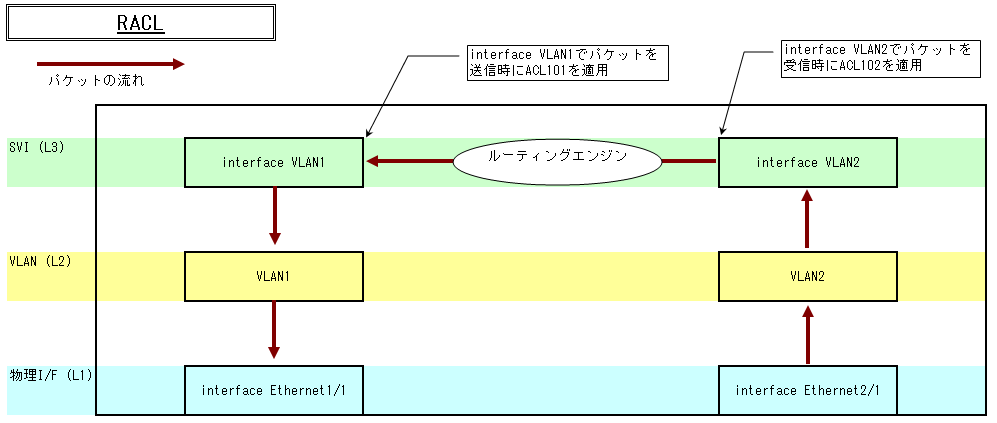

================================
ACL Access Control List
================================

ACLとは
================================

Access Control Listの略。

主にパケットフィルタリングに使用されます。そのほかにも経路の制御やNATのアドレスプールの定義、DHCPのプールアドレスの定義など幅広い方法で活用されます。

パケットフィルタリングの際、フィルターを適用する箇所により、RACL、VACL、PACLと名前が変わります。

+--------+-------------------+----------------+--------------------------------------+
| 種類   | RACL(Router ACL)  | VACL(VLAN ACL) | PACL(Port ACL)                       |
+========+===================+================+======================================+
| 設定先 | L3I/F             | VLAN           | スイッチポート(ポートチャネルを除く) |
+--------+-------------------+----------------+--------------------------------------+
| 適用時 | ルーティング      | スイッチング   | ルーティングおよびスイッチング       |
+--------+-------------------+----------------+--------------------------------------+
| 方向   | InputまたはOutput | Inputのみ      | Inputのみ                            |
+--------+-------------------+----------------+--------------------------------------+

* Cisco Catalystスイッチ教科書P132より引用

RACL
================================

ルーティング時にフィルタリングを適用します。適用場所はL3インタフェースとなります。

適用イメージ
--------------------------------

コンフィグ
--------------------------------

.. literalinclude:: config/racl.conf
    :linenos:

VACL
================================

スイッチング時にフィルタリングを適用します。適用場所はVLANとなります。

適用イメージ
--------------------------------

.. image:: images/acl_vacl.png

コンフィグ
--------------------------------

.. literalinclude:: config/vacl.conf
    :linenos:

PACL
================================

ルーティングおよびスイッチング時にフィルタリングを適用します。適用場所はポートチャネルを除くスイッチポートとなります。

